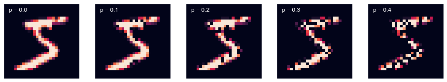
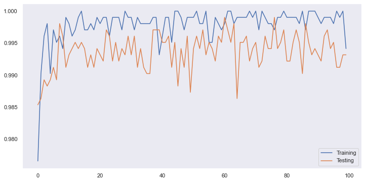
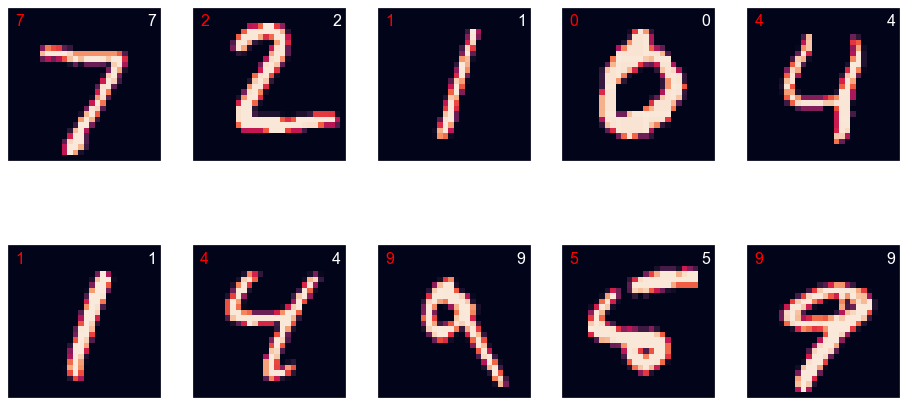

Neural network (NN) is one of the hottest topics today. Scientists have invented lots of specialized variations of them: Long/Short Term Memory (LSTM), Gated Recurrent Unit (GRU), Deep Convolutional Network (DCN), Auto Encoder (AE) and etc. All of those are essentially different ways of constructing parametric functional approximations. In this post, I would like to introduce some basics about networks.

### 1. Neural Network to the Bare-Bones

The simplest neural network actually has its own name: Logistic Regression. Assuming we have an input vector $X$ and a parametric matrix $M$, then it can be expressed as $\hat{Y}=\sigma(MX)$ where $\sigma$ is the sigmoid function which is $\sigma(x) = 1/(1 + e^{-x})$. A plain fully connected deep neural network can be expressed as the following:

$$
\begin{aligned}
A_0 &= X
\\
A_1 &= h(M_1A_0)
\\
A_2 &= h(M_2A_1)
\\
A_3 &= h(M_3A_2)
\\
\vdots
\\
\hat{Y} &= h(M_{n}A_{n})
\end{aligned}
$$

$X$ is the input, $Y$ is the output. $h$ here is a non-linear function which takes a vector as input and outputs another vector, theoretically it can be any function that is  differentiable. In practice, we often pick functions like ReLU, LeakyReLU or sigmoid (Ironically, ReLU and LeakyReLU is not differentiable at 0, but we still use them as they have computation advantages). $M_1, M_2 \dots,M_n$ are parametric matrices between each layer.

### 2. Build a Neural Network to Recognize Hand Written Digits

It is possible for one to hand make a neural network. But in practice, we often choose a mature deep learning framework to start with. Strictly speaking all those deep learning frameworks are essentially auto differentiation engines. As the raise of CUDA, all the main stream deep learning framework provide GPU based calculation, which is often a few times faster than CPU based calculation.

In this post, we choose PyTorch as our deep learning framework. I find PyTorch hides less than Tensorflow in API level, which make it easier when you want to use some uncanny architecture. In the rest of this post we will use PyTorch to train a neural network that can recognize MNIST hand writing digits.

#### 2.1 Download and Prepare Data

MNIST data is available almost everywhere, lots of deep learning framework ships MNIST dataset as a part of the package. In this post, we will do it in the old fashion way: download MNIST from [Yann LeCun's website](http://yann.lecun.com/exdb/mnist/). I have made a simple shell script to download the dataset which can be found [here](download.sh).

The data was code in IDX file format. The first 4 bytes are the magic number of the file. Depends on the dimension of the array, the consecutive bytes (4 as a chunk) indicates the shape of the array stored. The following code shows how to convert the binary file into an numpy array.


def load_data(filename):
    """
    Load data from Idx file.
        The first 4 bytes are magic number which indicates the file type
        The following bytes indicates the shape of the data
    """
    # determine the dimensionality of the array.
    match = re.search(re.compile('idx(?P<index_size>\d+)-ubyte.gz$'), filename)
    if not match:
        raise InvalidArgument("Not a idx byte file!")

    with gzip.open(filename, 'r') as fd:
        # parse the shape of the array.
        shape = [int.from_bytes(fd.read(4), 'big') for i in range(int(match.group('index_size')) + 1)][1:]
        # load data and reshape as the file indicated.
        return np.frombuffer(fd.read(), dtype=np.uint8).reshape(shape)


Load data as numpy array is not the end of the story. The pixel value is ranged from 0 to 255, feed this directly to neural network will cause the parameters of the neural network flutter up and down violently, therefore we normalize it by dividing 255. Further more, as PyTorch only operates on tensors, all the data needs to convert into tensors.


# We prefer GPU for training as it almost always means faster
if torch.cuda.is_available():
    device = torch.device('cuda:0')
else:
    device = torch.device('cpu')

def prepare(x, y):
    """
    Convert numpy arrays to tensors, and also normalize images.
    """
    # normalize image pixels
    images = torch.from_numpy(x.astype(np.float32))
    images /= 255.
    images = images.unsqueeze(1)

    # move data to GPU if available
    return images.to(device), torch.from_numpy(y).to(device, dtype=torch.long)

# Load training data.
train_x, train_y = prepare(
  load_data('data/train-images-idx3-ubyte.gz'),
  load_data('data/train-labels-idx1-ubyte.gz')
)

# Load testing data.
test_x, test_y = prepare(
    load_data('data/t10k-images-idx3-ubyte.gz'),
    load_data('data/t10k-labels-idx1-ubyte.gz')
)


In the above code, the planed output of neural network is in one-hot format. Theoretically, $y$ here need to be in one-hot format as well. But PyTorch provides a very convenient loss functor named `CrossEntropyLoss` which has done all those for us. Therefore, we only need to pack the ground truth label in a LongTensor.

#### 2.2 Describe The Neural Network Architecture in PyTorch

The following code shows a "deep" convolutional network, that reads an 28x28 grey scale hand writing digit and outputs the probabilities of being each digits (0 to 9):


import torch
from torch import nn

class Model(nn.Module):
    """
    Convolutional neural network for MNIST dataset
    """
    def __init__(self):
        # Required for any PyTorch Module
        super().__init__()

        # Layers
        self.layers = nn.ModuleList([
            # Convolutional Layer 1
            nn.Conv2d(1, 32, 3, padding=(1, 1)),
            nn.BatchNorm2d(32),
            nn.ReLU(),
            nn.Dropout(.1),
            nn.MaxPool2d(2),
            # Convolutional Layer 2
            nn.Conv2d(32, 64, 3, padding=(1, 1), bias=False),
            nn.BatchNorm2d(64),
            nn.ReLU(),
            nn.Dropout(.1),
            nn.MaxPool2d(2),
            # Convolutional Layer 3
            nn.Conv2d(64, 128, 3, padding=(1, 1), bias=False),
            nn.BatchNorm2d(128),
            nn.ReLU(),
            nn.Dropout(.1),
            nn.MaxPool2d(2),
            # Convolutional Layer 4
            nn.Conv2d(128, 128, 3, padding=(1, 1), bias=False),
            nn.BatchNorm2d(128),
            nn.ReLU(),
            nn.Flatten(),
            # Fully Connected layer 1
            nn.Linear(1152, 512, bias=False),
            nn.BatchNorm1d(512),
            nn.ReLU(),
            # Fully Connected layer 2
            nn.Linear(512, 256, bias=False),
            nn.BatchNorm1d(256),
            nn.ReLU(),
            # Fully Connected layer 3
            nn.Linear(256, 10, bias=False),
            nn.Softmax(dim=1)
        ])
        # Move model to GPU if possible
        self.to(device)

    def forward(self, x):
        # Apply each layer sequentially
        for layer in self.layers:
            x = layer(x)
        return x


**2.2.1 Convolutional Layer**

`torch.nn.Conv2d` defines a convolutional layer. Convolutional layers are very common in computer vision, as they shine in capturing local features. Assuming $X$ is a 3x3 matrix which represents a channel of a image, and K is a 2x2 matrix which is a kernel/filter matrix. Then their convolution can be express as the following:

$$
\begin{aligned}
X &= \begin{bmatrix}
  x_1 & x_2 & x_3\\
  x_4 & x_5 & x_6\\
  x_8 & x_7 & x_9\\
\end{bmatrix}
\\
K &= \begin{bmatrix}
  k_1 & k_2\\
  k_3 & k_4\\
\end{bmatrix}
\\
Conv(X, K) &= \begin{bmatrix}
  x_1k_1 + x_2k_2 + x_4k_3 + x_5k_4 & x_2k_1 + x_3k_2 + x_5k_3 + x_6k_4\\
  x_4k_1 + x_5k_2 + x_8k_3 + x_7k_4 & x_5k_1 + x_6k_2 + x_7k_3 + x_9k_4
\end{bmatrix}
\end{aligned}
$$

We can also illustrate the idea in plain Python:


from torch.nn import functional as F

def conv_channel(inputs, kernel, padding=(0, 0), stride=(1, 1)):
    iheight, iwidth = inputs.shape
    pheight, pwidth = padding

    # pad input image with zeros around border
    padded_inputs = torch.zeros(iheight + 2 * pheight, iwidth + 2 * pwidth)
    padded_inputs[pheight:pheight + iheight, pwidth: pwidth + iwidth] = inputs

    kheight, kwidth = kernel.shape

    # calculate output shape
    output_shape = (iheight - kheight + 1 + 2 * pheight, iwidth - kwidth + 1 + 2 * pwidth)
    output_shape = [np.ceil(o / s).astype(int) for o, s in zip(output_shape, stride)]

    # initialize output tensor
    output = torch.zeros(output_shape)

    for h in range(output_shape[0]):
        for w in range(output_shape[1]):
            # calculate with part of input image we want to filter
            hi, wi = [d * s for d, s in zip([h, w], stride)]
            # apply kernel/filter matrix to the part of the image and assign the result to output
            output[h, w] = (kernel * padded_inputs[hi:hi + kheight, wi:wi + kwidth]).sum()

    return output

# Define a single 1 channel (grey scale) 5x5 image
# Batch Size, Channel, Height, Width
inputs = torch.randn(1, 1, 5, 5)

# Define a single 2x3 kernel/filter
# Output Channel, Input Channel, Height, Width
kernel = torch.randn(1, 1, 2, 3)

# Compare conv_channel's output and PyTorch's conv2d's output

padding = (1, 2)
stride = (5, 3)

assert torch.eq(
    conv_channel(inputs[0, 0, :, :], kernel[0, 0, :, :], padding=padding, stride=stride),
    F.conv2d(inputs, kernel, padding=padding, stride=stride)[0, 0, :, :]
).all().item()


**2.2.2 Batch Normalization Layer**

Batch normalization, despite has a bit regulatory effect, is mainly used to speed up training. It is very commonly found in deep networks. Assuming batch $B$ have $n$ elements, then:

$$
\begin{aligned}
B &= \{x_1, x_2 \dots x_n\}\\
\mu_B &= \frac{1}{n}\sum_{i=1}^n x_i\\
\sigma^2_B &= \frac{1}{n} \sum_{i=1}^n (x_i - \mu_B)^2\\
\hat{x_i} &= \frac{x_i - \mu_B}{\sqrt{\sigma^2 + \epsilon}}\\
B_{normalized} &= \{\hat{x_1},\hat{x_2} \dots \hat{x_n}\}
\end{aligned}
$$

It can be also very easily illustrated in plain python:

inputs = torch.randn(5, 3)

# Mean
mu = torch.randn(3)
# Variance
var = torch.randn(3) ** 2

# We use epsilon to prevent denominator to be zero
epsilon = 1e-5

torch.isclose(
    F.batch_norm(inputs, mu, var, eps=epsilon),
    (inputs - mu) / (var + epsilon).sqrt()
)


There is one more thing worth to notice, as after batch normalization expectation of the input is zero, we don't have to have bias for the next adjacent layer.

**2.2.3 Dropout Layer**

Deep neural network is susceptible to over fit. It has so many parameters, which make it very vulnerable to fit into the noise in the training set. Dropout is a very computationally cheap way of regulating neural networks.

Dropout only takes effect while in training. Assume input $X = \begin{bmatrix} x_1 & x_2 & \dots & x_n \end{bmatrix}$ mask array $D = \begin{bmatrix} d_1 & d_2 & \dots d_n \end{bmatrix}$ and $\forall d_i \in \{1, 0\}\; i \in \{1 \dots n\}; p = 1 - \frac{1}{n}\sum_{i=1}^n d_i$ where p is the dropout rate. Then dropout output $\hat{X} = \begin{bmatrix} x_1 d_1 & x_2 d_2 & \dots & x_n d_n\end{bmatrix}$. After training is done, we need scale down parameters with $1 - p$, as dropout makes those coefficients a bit larger.

To illustrate this concept a bit intuitively, we can apply dropout on a MNIST hand writing images:

We can still recognize those digits, although the last image has 40% of its feature missing. To some extent we can think dropout provides a way of breaking weak covariance between variables. Therefore, it encourages neural network to seek more reliable features, which makes our neural networks generalize better.

**2.2.4 Max Pooling Layer**

Max pooling layers have some regulatory effects by emphasising the most locally activated feature, enticing neural networks develop distinctive features.

Max pooling mechanism is somewhat similar to convolution. In both mechanism, we have a moving window size defined by kernel size and dilation. In convolution, what we after is the dot product between the matrix selected by moving window and kernel matrix, but in max pooling we only after the maximum value in selected window.

The following code illustrate the idea of max pooling with dilation:


from torch.nn import functional as F

def max_pool_channel(inputs, kernel_size=2, dilation=1, stride=None):
    """Max pooling inputs on a single channel (matrix level max pooling)"""

    # Default stride to kernel size
    stride = stride or kernel_size

    # Calculate indices for pooling
    x_ind = (torch.arange(kernel_size) * dilation).unsqueeze(1).repeat(1, kernel_size).flatten()
    y_ind = (torch.arange(kernel_size) * dilation).repeat(kernel_size)

    # Determine result size
    x_end = inputs.shape[0] - x_ind.max() + 1
    y_end = inputs.shape[1] - y_ind.max() + 1

    assert x_end > 0 and y_end > 0, "It does not make sense to max pooling a input smaller than kernel!"

    xsteps = torch.arange(0, x_end, stride)
    ysteps = torch.arange(0, y_end, stride)

    result = torch.empty(xsteps.shape[0], ysteps.shape[0])

    for i, anchor_x in enumerate(xsteps):
        for j, anchor_y in enumerate(ysteps):
            # perform max pooling
            result[i, j] = inputs[anchor_x + x_ind, anchor_y + y_ind].max()

    return result

inputs = (torch.randn(1, 1, 9, 9) * 100).floor()

assert torch.isclose(
    max_pool_channel(inputs[0, 0, :, :], kernel_size=3, dilation=2),
    F.max_pool2d(inputs, kernel_size=3, dilation=2)
)



#### 2.3 Train the Network

Now we have briefly discussed the convolutional neural network (CNN) we defined. When a neural network is initialized, all its parameters are set to random numbers. This is actually crucial for a neural network, as stochastic gradient descent (SGD) like methods are dominantly used in training neural networks. Uniformly set neural network initial weights pair with SGD like training methods will impair neural network's ability to capture different features. There are many ways of initializing the weights. Pytorch initialize weights base on the type of the layer by default, in our case it is using Xavier initialization for both convolutional layers and linear layers.

As I mentioned before: after all these years development, stochastic gradient descent is still the main work horse for neural network training. But we rare use pure stochastic gradient descent anymore in practice. Variants like Adagrad, RMSProp and Adam have superseded SGD. The solo problem those variant optimizers trying to resolve is that the learning rate for different parameter in different phase of training should be different to be optimal and it is tedious and if not impossible to adjust those by hands.

The following code shows how typically a neural network is trained with Pytorch:


# This is a library used for tracking our training progress
from tqdm import tqdm

def evaluate_model(test_x, test_y, criterion, model, size=512):
    "Evaluate model with randomly sampled data points"
    try:
        model.eval()

        with torch.no_grad():
            # test on samples from test set
            index = torch.multinomial(torch.arange(test_x.shape[0], dtype=torch.float32), 512)
            return criterion(model(test_x[index, :, :, :]), test_y[index]).cpu().numpy()

    finally:
        model.train()

def train(train_x, train_y, test_x, test_y, model, n_epoch=100):
    # With DataLoader provided by pytorch we can easily seperate data into batches.
    dataset = TensorDataset(train_x, train_y)
    loader = DataLoader(dataset, batch_size=64)

    # As this is a multi-categorical problem, the most suitable loss function is cross entropy
    criterion = nn.CrossEntropyLoss()

    # For optimizer we choose Adam, which is a SGD variant
    # that employes momentment and friendly to gradients with different magnitudes
    optimizer = torch.optim.Adam(model.parameters(), lr=1e-4)

    train_history = []
    test_history = []

    try:
        # set model in training mode
        model.train()
        for epoch in tqdm(range(n_epoch)):
            for xs, ys in loader:
                # calculate predictions
                yhats = model(xs)

                # judge our prediction with loss function
                loss = criterion(yhats, ys)

                # clear out gradient left from last iteration
                optimizer.zero_grad()

                # generate gradient by back propagation
                loss.backward()

                # apply gradient * learning_rate to weights
                optimizer.step()

            # log training and testing accuracy
            train_history.append(evaluate_model(train_x, train_y, model))
            test_history.append(evaluate_model(test_x, test_y, model))

        return [np.hstack(history) for history in [train_history, test_history]]

    finally:
        # set model in evaluation mode
        model.eval()


Stochastic gradient descent brings down the computational cost significantly. But also it makes the training targets wandering around the lowest loss function terrain instead directly pointing to it. Therefore we are expecting the accuracy to jump up and down during the training process. The gap between training and testing, we can roughly consider those as over fit. As neural networks learned some features from training set that can not be generalized to testing sets, which means those features are actually noises. Therefore we over fit our neural network to the training set.

#### 2.4 Visualize Predictions

Now we have a trained model, let us checkout its predictions on the test sets.


def visualize(model, x, y):
    # predict labels and convert result to numpy arrays
    predicted_labels = model(x).argmax(dim=1).cpu().numpy()
    labels = y.cpu().numpy()
    images = x.squeeze(1).cpu().numpy()

    plt.figure(figsize=(16, 8))

    for i, image in enumerate(images):
        plt.subplot(2, 5, i + 1)
        plt.imshow(image)
        plt.tick_params(
            labelbottom=False)
        plt.tick_params(
            labelleft=False)
        # print out predictions on the top left corner
        plt.text(1, 3, f'{predicted_labels[i]}', fontsize=16, color='red')
        # print out true label on top right corner
        plt.text(25, 3, f"{labels[i]}", fontsize=16, color='white')

    plt.savefig('predict.png', bbox_inches='tight')
    plt.show()

visualize(model, test_x[:10, :, :, :], test_y[:10])


