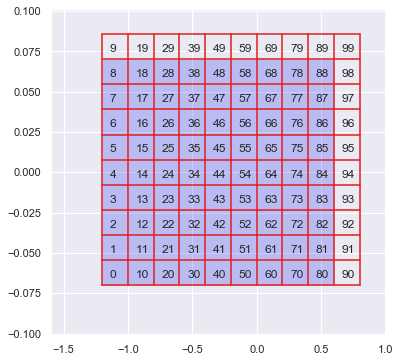
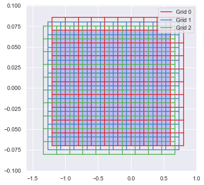
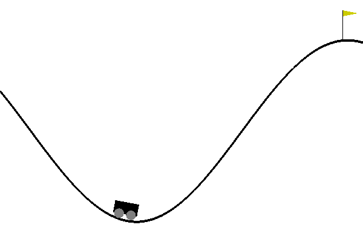

In our last post, we have used a table to track action values and built an agent that can solve randomly generated mazes. Table based $Q(s, a)$ is pretty useful. Even in some cases that states are continuous, by discretizing states into integers we can still present action-value function with a table. In this post we are going to discuss a more general way of representing action-value function with Linear methods.

### Linear Method

We can denote action value as $Q(s, a) = W(a)^TX(s)$, where $W(a)$ is the weight vector and $X(s)$ is the feature vector.
Table base method is actually special case of linear method.
For example, we have a environment that have n states, and we use the following vectors to present each state:

$$
\begin{aligned}
X(0) &= \begin{bmatrix} 1& 0& \dots& 0& \end{bmatrix}^T\\
X(1) &= \begin{bmatrix} 0& 1& \dots& 0& \end{bmatrix}^T\\
     &\vdots\\
X(n) &= \begin{bmatrix} 0& 0& \dots& 1& \end{bmatrix}^T
\end{aligned}
$$

This is also call one-hot encoding. As at any time, there is only 1 entry in the vector that is not 0 but 1. Then the dot product will become a index selection, which is exactly the table base method.

### Tile Encoding

In reality the state values are often real values.
One way of dealing with this is discretize real numbers into integers.
As shown in the following figure, we can draw a grid on the value plane (If the state is two dimensional), and assign a integer value to each box, then any state falls into the box can be represented with the number assigned to the box.

And we can have multiple grids at once with each grid offset each other a little bit, as shown in the following figure.

Here is an implementation of tile encoding in python.


def make_activate(env, tiles, tilings):
    """
    make activate function which encode state into tile coding

    params:
        env     : AI Gym environment
        tiles   : an array specify how many tiles we should have at each dimension
        tilings : how many grids we should have
    """

    obs = env.observation_space
    lb, ub = obs.low, obs.high

    # We need a way of ravel multi-index. see aslo numpy.ravel_multi_index
    units = np.hstack([[1], np.cumprod((tilings, ) + tuple(tiles))])[:-1]

    # We want our grid one tile larger than the value range,
    # therefore we don't get overflow when shifting the grid.
    scale = np.diag((np.array(tiles) - 1) / (ub - lb))

    # grid offset
    offset = np.arange(tilings) / tilings

    def feature(x, debug=False):

        # We don't really generate grid to determine which tile we are,
        # but we project the state on a hyper-cube with size defined by tiling and stiles
        # At last we can use np.floor to acquire the multi-index of a given state.

        fs = np.column_stack([
            np.arange(tilings),
            np.floor((scale @ (x - lb)).reshape(1, -1) + offset.reshape(-1, 1)).astype(int)
        ])

        # We ravel the multi-index by acquire the dot product with units
        return units @ fs.T

    return feature


### Q-Learning with Tile Encoding

To make sure we have a good approximation of the optimal action value function, we want $\sum \mu(s) [Q^*(s, a) - Q(s, a, W)]^2$ to be minimum, where $Q^*$ is the optimal policy, s and s' are current state and next state correspondingly, $r$ is the reward, $\mu(s)$ is the state distribution. We can update $W$ with stochastic semi-gradient descent:

$$
\begin{aligned}
W_{t + 1} &= W_t - \frac{1}{2}\alpha\nabla[Q^*(s, a) - X(s)^T W_t]^2\\
          &= W_t - \alpha[Q^*(s, a) - Q(s, a, W_t)] X(s)
\end{aligned}
$$

Also there is an implementation trick we used here. $X(s)$ is a special vector, majority of it are zeros and the rest entries are ones.
If we denote $(i_1, i_2 \dots i_n)$ the index of none zeros entries of $X(s)$, then $W(s)^TX(s) = \sum_{j=i_1}^{i_n} W_j$. Therefore we avoid the dot product by simply summing up corresponding none zero entries in $W(s)$.


n_action = env.action_space.n

# How many epoch and max_steps we train
n_epoch = 1000
n_maxstep = 300

# Feature extraction function with 20 10x10 tiles
activate = make_activate(env, [10, 10], 20)

# Linear weight
W = np.zeros((10 * 10 * 20, 3))

# Learning rate
alpha = 0.01

# Discount, as the task is episodic we can make it equal to 1
gamma = 1

# Linear degraded ϵ
epsilon_space = np.linspace(1, 0.05, n_epoch // 2)

with tqdm(range(n_epoch)) as prog:
    for epoch in prog:
        state = env.reset()
        epsilon = epsilon_space[min(epoch, epsilon_space.shape[0] - 1)]

        # the environment we use is actually time bounded, we can also use `while True:`
        for _ in range(n_maxstep):
            s = activate(state)

            if np.random.rand() < epsilon:
                action = env.action_space.sample()
            else:
                values = np.sum(W[s, :], axis=0)
                action = np.random.choice(np.arange(n_action)[values == np.max(values)])

            state_next, reward, is_done, _ = env.step(action)
            sp = activate(state_next)

            # np.sum(W[sp], axis=0) is another way to do dot product
            expected = reward + gamma * np.max(np.sum(W[sp], axis=0)) * (1 - is_done)
            W[s, action] += alpha * (expected - np.sum(W[s, action]))

            if is_done:
                break
            state = state_next


The following figure shows how the agent behaves after 1000 epoch training in `MountainCar-v0` environment.

### Misc

Full Jupyter notebook can be found [here](https://github.com/yeyan/ML-Notebooks/blob/master/2020-04-23/QLearningFnApprox.ipynb).
